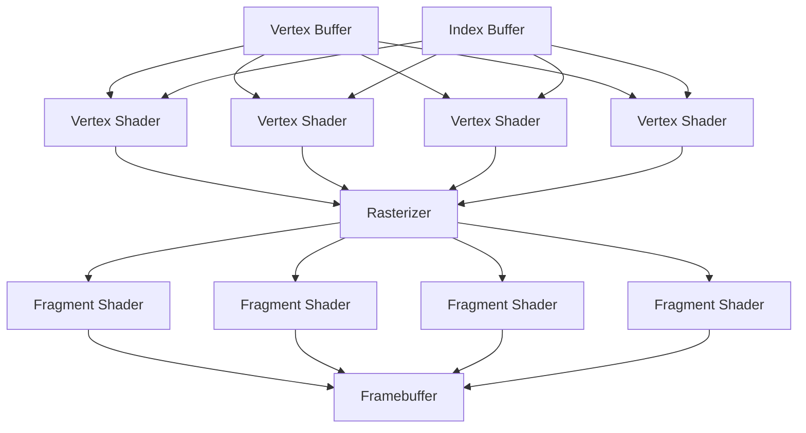

# Raster Algorithm Notes
- Raster/depth buffer algorithm: how the majority of modern GPUs work
- Vertex buffer: List of vertices
- Index buffer: List of vertex buffer indices that make a triangle: `index_buffer[0] = {4, 2, 47}`, where the triangle is `vertex_buffer[4], vertex_buffer[2], vertex_buffer[47]`.
- Model/view/camera matrix: Matrix to transform a model from model space to world space
- Shader: A single compute unit on a GPU
  - Vertex shader: Takes in a vector from the mesh and transforms it into world space using the model view matrix
  - Fragment shader: Takes in a color from the rasterizer and applies lighting and shading
- Vertex: A vertex of the mesh
- Fragment: A pixel
- Depth buffer: The distance from the camera to the thing in each pixel in the screen. Initialized to infinity, as triangles are rasterized the distance from the camera to the point on the triangle represented by pixel X, Y on the screen is assigned to `depth_buffer[X][Y]`.
- Rasterizer: Takes in a triangle (3 vertices) in world space and translates it to pixel coordinates in screen space. Performs the depth buffer test. Applies textures using texture coordinates. Outputs a finished pixel with X, Y coordinates on the screen and a color.

## The pipeline

## Lighting
### Direct Illumination
The dumb, easy way to do lighting. Doesn't simulate light bouncing or scattering as it hits different surfaces.

Done by pixel in the fragment shaders using the pixel color and a normal vector for the face containing the pixel.
- If the angle between the face and the light is < 90 degrees in any direction the pixel gets the color assigned by the rasterizer (the texture color)
- If the angle between the face and the light is >= 90 degrees (either perpendicular or facing away) the pixel is black.

### Global Illumination
Slightly harder way to do lighting. Simulates light bounces and scattering, giving softer shadows and more photorealism.
